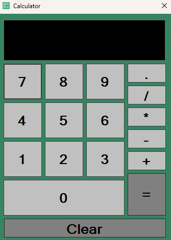
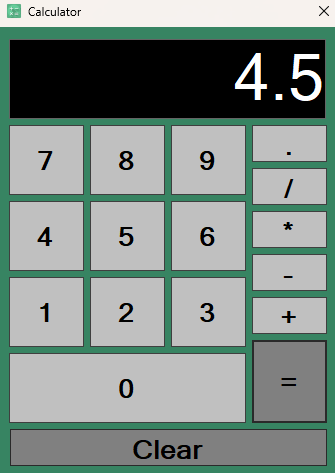
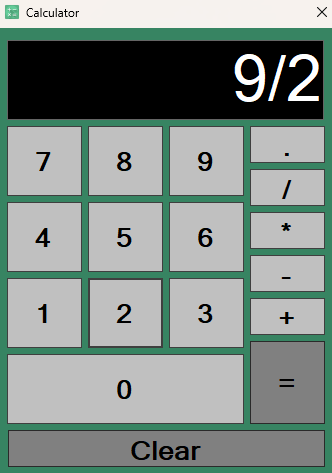

# WinForms Calculator

A simple **Calculator application** built using **C# WinForms**.  
This project allows users to perform basic arithmetic operations including addition, subtraction, multiplication, and division. It also supports decimal numbers and validates input to prevent invalid operations like multiple decimal points or division by zero.

---

## Features

- Basic arithmetic: `+`, `-`, `*`, `/`
- Support for decimal numbers
- Validation to prevent invalid inputs:
  - Multiple decimal points in the same number are not allowed
  - Division by zero is prevented
- Clean and intuitive WinForms interface
- Displays results in real-time

---

## Screenshots

### 1. Calculator in empty state

### 2. Calculator showing an operation `9 / 2`

### 3. Calculator showing the result `4.5`

---

## Usage

1. Enter numbers using the buttons on the calculator.
2. Click arithmetic operators (`+`, `-`, `*`, `/`) to perform calculations.
3. Click the `.` button to add decimal points. Only one decimal point is allowed per number.
4. Click `=` to calculate the result.
5. If division by zero is attempted, a warning will appear.

---

## Technical Details

- Developed using **C# WinForms**
- Uses a **TextBox** (`txbScreen`) as the display
- Arithmetic expressions are evaluated using `DataTable().Compute()` internally
- Input validation is implemented to ensure correct formatting and prevent runtime errors

---

## How to Run

1. Open the solution in **Visual Studio**.
2. Build the project.
3. Run the application.
4. Use the calculator interface to perform arithmetic operations.

---

## File Names for Images

- `calculator_empty.png`
- `calculator_operation.png`
- `calculator_result.png`

Place these images in the same directory as this README to display them correctly.